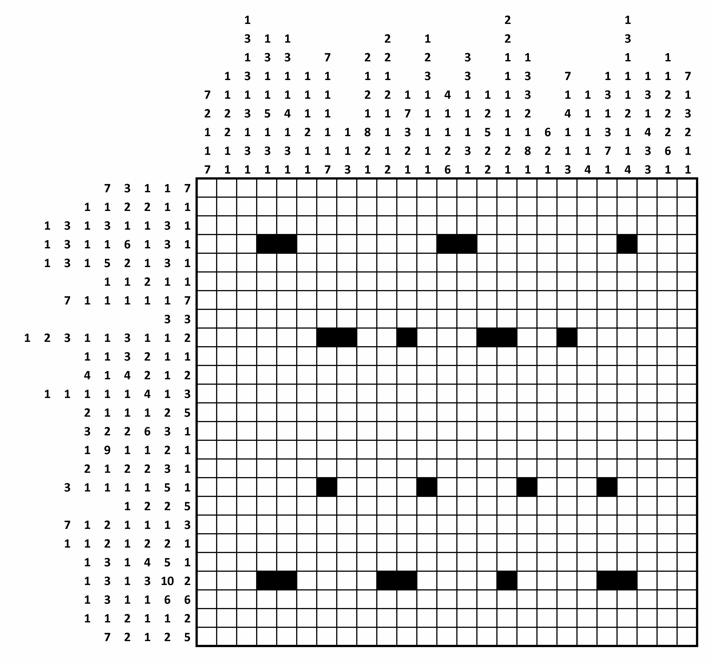

# gchq-puzzle-2015
A C++ Solver for the 2015 GCHQ Christmas Puzzle Part 1

The puzzle is hardcoded in the C++ code, and the end result is a bitmap
representing the solution.

# Description
In this type of grid-shading puzzle, each square is either black or white. Some
of the black squares have already been filled in for you.

Each row or column is labelled with a string of numbers. The numbers indicate
the length of all consecutive runs of black squares, and are displayed in the
order that the runs appear in that line. For example, a label "2 1 6" indicates
sets of two, one and six black squares, each of which will have at least one
white square separating them.

